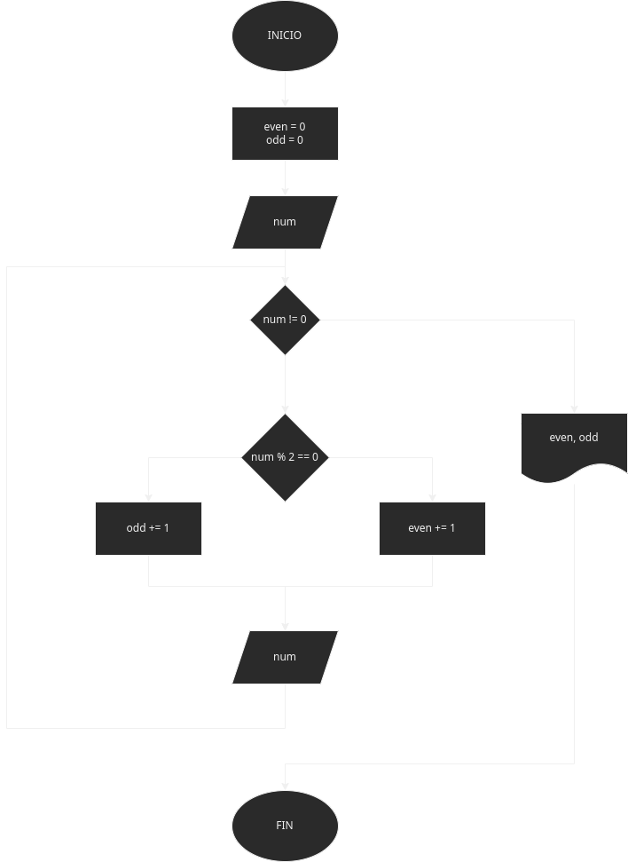

# Registro centinela 2
Hacer el diagrama de flujo y el programa en python que lea numeros enteros positivos(uno en cada lectura) y que averigue en imprima 
cuantos son pares y cuantos impares, para terminar usaremos el registro centinela cuan el valor sea 0

# Análisis
En primer lugar el codigo me va a pedir un numero, para comparar si el número es par o impar lo vamos a dividir entre el modulo de 2, si llega a ser igual a cero es par y si es diferente
es impar, habrá un contador de números pares e impares que se imprimirá al final.

# Diseño

